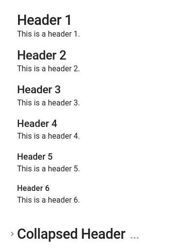
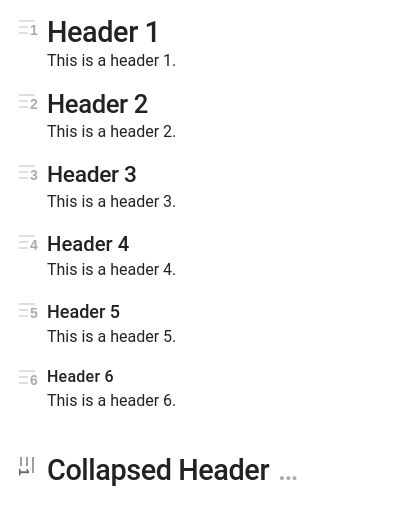

# Header Level Icons for Obsidian

Header level icons provide a visual indicator of the header level. This is useful to understand the structure of 
your document when editing.

This is a pure CSS implementation, no JavaScript is used.

## Before

## After

## How to install

Save the `header-level-icon.css` file to your computer.

Copy the css file into your vaults configuration folder. If your not sure where that is. Open `Settings`, go to `Appearance` (left menu), scroll down to `CSS Snippets`, click the folder icon to open your snippets folder.

Once you have copied the file to your snippets it should appear in the list of `CSS Snippets`, otherwise click the refresh button, next to the open folder icon. Enable `header-level-icons` by flicking the switch. See the [Obsidian CSS snippets docs for instructions.](https://help.obsidian.md/Extending+Obsidian/CSS+snippets)

For mobile, you will need to sync the snippet from your desktop vault and then enable it in your mobile settings.

## How it works

Uses a `::before` selector to add a SVG background in place of the header fold icon.

Sets the default header fold to be transparent so that it's still clickable not covering the header level icon.

When the header is folded it is rotated 90deg and made darker.
